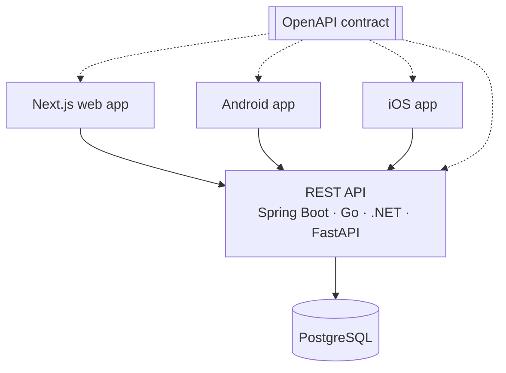

# mustafagokselgokmen

A multi-platform application that demonstrates a contract-first REST API implemented in several
backend technologies. It has shared authentication and contact management, and behaves the same way
on web and mobile clients.

> Status: early development.

## Features

- Sign in with Google on web, Android and iOS
- A contact form for signed-in users, where each user can see the status of the messages they sent
- An admin workflow: list messages, filter them by status, and move them from `NEW` to
  `IN_PROGRESS` to `RESOLVED`
- One API, implemented in Spring Boot, Go, .NET and FastAPI, with every implementation verified by
  the same tests

## Architecture



- **Contract first.** The API is defined in `contract/openapi.yaml`. Server interfaces and clients
  are generated from it.
- **Google identity, application tokens.** Clients sign in with Google, then exchange the Google
  token for the API's own JWT access token and refresh token.
- **Layered backend:** Controller → Service → Repository → Database
- **MVVM on mobile:** View → ViewModel → Repository → API

More: [Architecture](docs/architecture.md)

## Applications

| Application | Stack | Path | Status |
|---|---|---|---|
| Web | Next.js, React, TypeScript | [`frontend/nextjs`](frontend/nextjs) | Planned |
| Android | Kotlin, Jetpack Compose | [`mobile/android`](mobile/android) | Planned |
| iOS | Swift, SwiftUI | [`mobile/ios`](mobile/ios) | Planned |

## Backend Implementations

| Backend | Stack | Path | Status |
|---|---|---|---|
| Spring Boot | Java 21, Spring Boot, Spring Data JPA | [`backend/spring-boot`](backend/spring-boot) | In progress |
| Go | — | `backend/go` | Planned |
| .NET | — | `backend/dotnet` | Planned |
| FastAPI | — | `backend/fastapi` | Planned |

## Technology Stack

| Area | Technologies |
|---|---|
| API contract | OpenAPI 3.0.3 |
| Identity | Sign in with Google (OpenID Connect) |
| Backend | Java, Spring Boot, Spring Security (JWT), Flyway, PostgreSQL, Kafka |
| Web | Next.js, React, TypeScript, Tailwind CSS |
| Android | Kotlin, Jetpack Compose, Hilt, Retrofit, Coroutines, Flow, Credential Manager |
| iOS | Swift, SwiftUI, async/await, URLSession, Keychain |
| Testing | JUnit 5, Testcontainers, Vitest, Playwright, MockK, Swift Testing, Schemathesis, Hurl |
| Containers and CI/CD | Docker, Docker Compose, GitHub Actions, GitHub Container Registry |
| Security scanning | CodeQL, Trivy, Dependabot |
| Observability | Spring Boot Actuator, structured JSON logging |

## Repository Structure

```
contract/     OpenAPI contract and API scenario tests
backend/      backend implementations
frontend/     web app
mobile/       Android and iOS apps
docs/         standards, architecture and decision records
```

## Getting Started

Prerequisites:
- Docker
- JDK 21, for backend development
- Node.js 24 LTS, for the web app and the contract tooling
- Android Studio, for the Android app
- Xcode on macOS, for the iOS app
- A Google Cloud project with OAuth client IDs for web, Android and iOS

Run the local stack:

```bash
cp .env.example .env          # then set POSTGRES_PASSWORD
docker compose up --build     # starts PostgreSQL and the API at http://localhost:8080
curl http://localhost:8080/actuator/health
```

To develop the backend from source, see [Build and Run](AGENTS.md#build-and-run).

## Testing

Every application has unit and integration tests. In addition, every backend implementation must
pass the same contract tests. These tests are generated from the OpenAPI contract or written against
it, and they sign in through a mock identity provider rather than Google.

More: [Testing](docs/testing.md)

## CI/CD

- **CI:** GitHub Actions checks every pull request with linting, a build, tests, security scans
  (CodeQL, Trivy) and a Docker image build.
- **CD:** a release tag publishes the images to GitHub Container Registry.

More: [DevOps](docs/devops.md)

## API Contract

The API is defined in [`contract/openapi.yaml`](contract/openapi.yaml). To lint it:

```bash
npx @redocly/cli lint contract/openapi.yaml
```

More: [API standards](docs/api.md)

## Documentation

- [Development guide](AGENTS.md)
- [Architecture](docs/architecture.md)
- [API standards](docs/api.md)
- [Database standards](docs/database.md)
- [Security standards](docs/security.md)
- [Testing standards](docs/testing.md)
- [Git standards](docs/git.md)
- [DevOps standards](docs/devops.md)
- [Observability standards](docs/observability.md)
- [Architecture decision records](docs/decisions/)

## License

[MIT](LICENSE)
