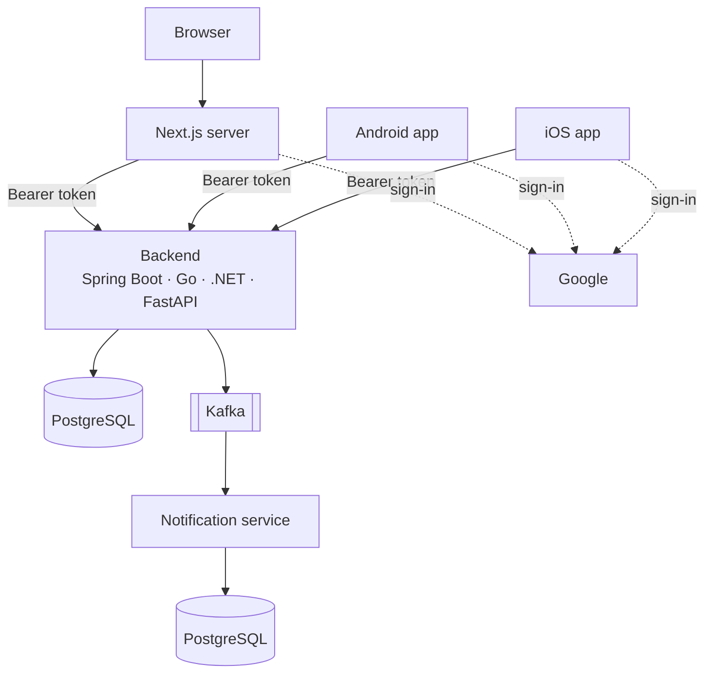
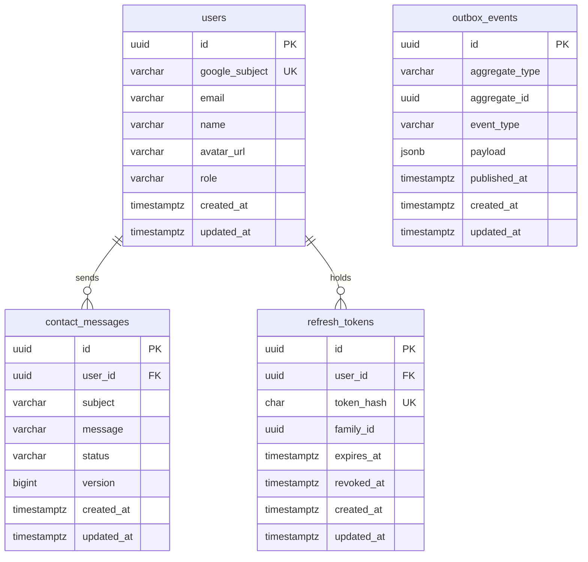
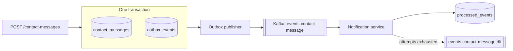
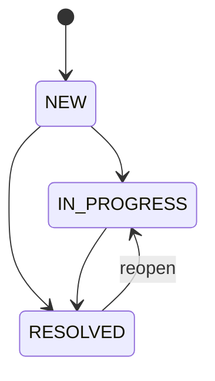
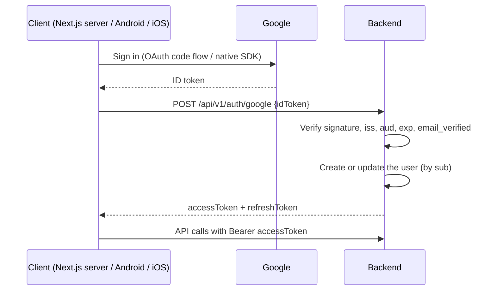
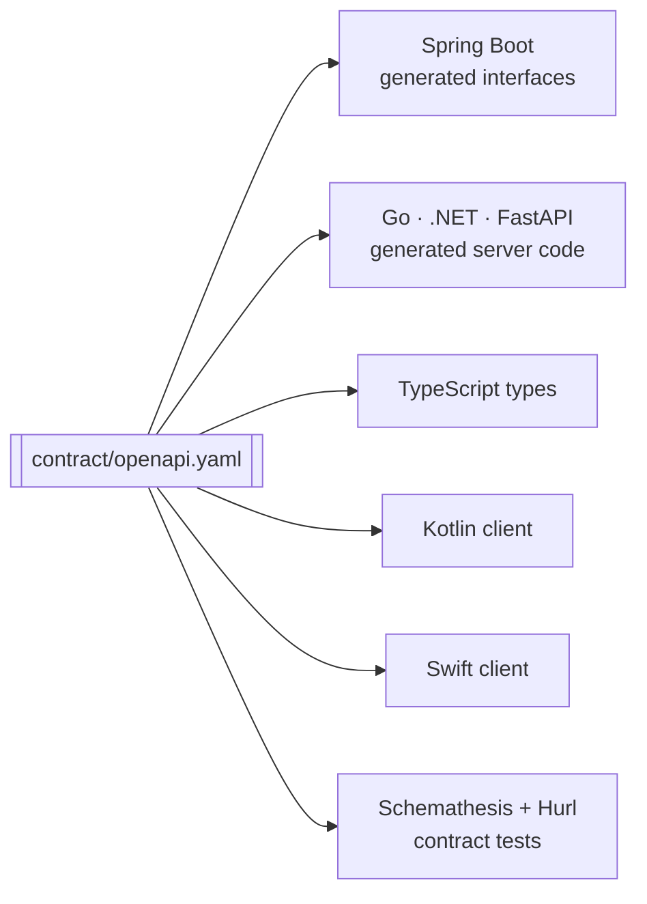

# Architecture

## System overview



- **One API for every client.** Business rules are implemented once, in the backend. Clients handle
  presentation and user interaction.
- **Google proves identity; the API issues its own tokens.** After sign-in, API calls never involve
  Google. See [ADR-006](decisions/006-google-sign-in.md).
- **Backend-for-frontend (BFF) for the web.** The browser talks only to the Next.js server. That
  server keeps the tokens in `HttpOnly` cookies and calls the backend. As a result, tokens never
  reach browser JavaScript, and the backend needs no CORS or CSRF handling.
  See [ADR-003](decisions/003-authentication.md).
- **Mobile apps call the backend directly** and keep their tokens in the platform's secure storage.
- **Backends are interchangeable.** Every backend implements the same contract and passes the same
  tests, so any client can run against any backend.
- **Work that follows a request runs elsewhere.** The API publishes events; the notification
  service consumes them. No client waits for that work, and each service owns its own data.

## Domain

The first release is a small but real business flow, not a demo CRUD:

- **Visitors** browse the public pages of the web app. These pages are static and don't call the
  API.
- **Users** sign in with Google and send contact messages. They can see their own messages and the
  status of each one.
- **Admins** see every message, filter by status, and move messages through a simple workflow.

This single feature exercises authentication, authorization, a relational model, pagination,
filtering and optimistic concurrency.

### Data model



- **Users are identified by the Google `sub` claim** (`google_subject`). Email is profile data, not
  identity.
- **A message can't be edited after it is sent.** Only its status changes.
- **`refresh_tokens`** makes token rotation and revocation possible.

### Events

Sending a message also records an event, in the same transaction:



The message and the event are stored together or not at all. A publisher drains the table
afterwards, so a failure to publish never loses the event and never rolls back the request
([ADR-008](decisions/008-transactional-outbox.md)).

Events go to Kafka, keyed by the aggregate's id and carrying `event-id`, `event-type` and
`aggregate-type` headers ([ADR-009](decisions/009-kafka-for-events.md)). Publishing is at least
once, so consumers must be idempotent. Where no broker is available, such as the contract tests,
the target writes a log line instead.

### Consumers

The notification service reads those events. It is a separate deployable with a database of its
own, so the work that follows a contact message doesn't share the API's process, and the consumer
can't read the API's tables ([ADR-010](decisions/010-event-consumer-resilience.md)).

- **Handled once:** before notifying, it claims the event's id in `processed_events`. A second
  delivery of the same event finds the id taken and does nothing.
- **Retried, then set aside:** a failure that may recover is retried with a growing pause; one that
  can't — a missing header, an unreadable body — goes straight to `events.contact-message.dlt`.

The notification itself is a log line for now. What surrounds it is real, so adding email or push
delivery is a change in one class.

### Message status



Setting a message to the status it already has changes nothing. Any transition not shown above
returns 409.

### Sign-in



## Contract first



The contract is written first. Every other artifact is either generated from it or tested against
it.

**Why:** there are four backends and three clients. If the spec were generated from one backend's
code, that backend would become the de facto standard, and the others would have to copy it. With
the contract first, disagreements about the API surface at build time or in the contract tests,
not in production. See [ADR-002](decisions/002-openapi-contract.md).

## Backend

```
Controller  →  Service  →  Repository  →  Database
```

| Layer | Responsibility | Must not |
|---|---|---|
| Controller | Maps HTTP onto the contract: implements the generated interface and delegates to one service method | contain business logic, access repositories, handle entities |
| Service | Orchestrates use cases: authorization, transaction boundary, loading and saving, mapping entities to API models | know about HTTP (status codes, requests, responses); duplicate domain rules |
| Domain model | Invariants and state transitions, such as `ContactMessage.changeStatus` | depend on Spring beans or HTTP |
| Repository | Persistence and queries | contain business rules |

**Why:**
- HTTP details stay out of business logic.
- The rules for each use case live in exactly one place, which is easy to test.
- Queries are isolated, so they can be tested against a real database.

Code is organized into packages by bounded context, not by layer. There are two contexts:
- `identity`: users, roles, sign-in, tokens
- `contact`: contact messages

This is DDD in a light form. Each context owns its data and rules, and `contact` refers to users
only by ID. It does not add repositories-behind-interfaces, application-service layers or other
ceremony that the domain doesn't need.

## Web

```
Server/Client Component  →  API client  →  Backend
```

- **Public pages** are static and never call the API.
- **Server Components** fetch data. **Server Actions** perform mutations.
- **Client Components** are used only for interactivity.
- **The API client** runs on the server only and is the single point of contact with the backend.
  It attaches the token and turns errors into typed values.

**Why:** rendering on the server keeps tokens and backend URLs away from the browser, and keeps the
JavaScript sent to the browser small.

## Mobile: MVVM

```
Compose UI / SwiftUI View  →  ViewModel  →  Repository  →  API (generated client)
                                                  └──→  local cache (Room, when needed)
```

| Layer | Responsibility |
|---|---|
| View | Renders a UI state and forwards user intents. Stateless where possible. |
| ViewModel | One per screen. Owns a single immutable UI state and turns intents into repository calls. |
| Repository | The single source of data. Maps generated API models to domain models, maps errors to typed app errors, and owns caching. |

**Why:**
- MVVM is the pattern each platform recommends: the Android architecture guide, and SwiftUI with
  Observation.
- ViewModels can be unit-tested without any UI.
- Both platforms share the same structure, so a feature can be ported one-to-one.
- Generated API code stays inside repositories, so a contract change never reaches the UI directly.

See [ADR-005](decisions/005-mobile-architecture.md).

## Alternative backends

Go, .NET and FastAPI implement the same contract with the same layers. Each uses its ecosystem's
usual names for them (for example handler → service → repository). Each backend gets its own
standard under `docs/backend/` when work on it starts. A backend is complete when it passes the
contract test suite unchanged.

## Decision records

- [ADR-001: API versioning](decisions/001-api-versioning.md)
- [ADR-002: OpenAPI contract first](decisions/002-openapi-contract.md)
- [ADR-003: Authentication](decisions/003-authentication.md)
- [ADR-004: Database migrations](decisions/004-database-migration.md)
- [ADR-005: Mobile architecture](decisions/005-mobile-architecture.md)
- [ADR-006: Sign in with Google](decisions/006-google-sign-in.md)
- [ADR-007: Docker Compose and GitHub Actions](decisions/007-containers-and-ci-cd.md)
- [ADR-008: Transactional outbox](decisions/008-transactional-outbox.md)
- [ADR-009: Kafka as the event broker](decisions/009-kafka-for-events.md)
- [ADR-010: Consumer resilience and idempotency](decisions/010-event-consumer-resilience.md)
